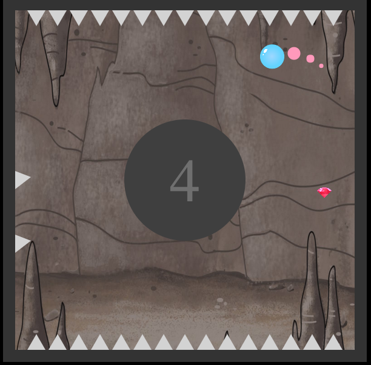

<div align="center"> <h1> Don't Pop The Bubble </h1>

<h4> Don’t Pop The Bubble is a browser edition of the game Don’t Touch The Spikes </h4>

<p>The object of the game is to keep the bubble alive as long as possible, and to collect as many gems as you can along the way! If you hit any of the spikes you die, watch out because as the levels increase there are more and more spikes…</p>
</break>
<a href="http://meredithanya.github.io/DontPopTheBubble">Play Now!</a>
</break>

</div>

<p align="center">
  
</p>

## Code Structure

### Bubble

The bubble always has a constant horizontal velocity that flips sign when it collides with the walls, but has an increasingly more “downward” vertical velocity each frame. In order to achieve the “downward” effect, the vertical velocity actually gets larger because of the coordinate system origin being at the top left. 

I gave the bubble an initial “negative” velocity (meaning it would appear to be going up) so that the player would have more time to be ready for game play. 
Pressing the spacebar sets the vertical velocity to a “negative” velocity so that it pushes the bubble up, therefore keeping the bubble alive.

### Bubble Trail

Each time the player presses the spacebar, a bubble trail is created following the bubble’s movement. This was implemented by having a series of setTimeout functions within the ```bubble.up();``` function and drawing circles trailing the bubble whose radiuses(radii) shrink until they are no longer drawn. 

### Spikes

Spikes line the top and bottom edges of the canvas while left and right spikes are randomly generated each time the bubble collides with the wall. The number of spikes displayed comes from the level being passed into the ```randoRightSpikes();``` or ```randoLeftSpikes();``` functions.

### Gems

At the beginning of the game, a gem is randomly generated on the left and switches only once the bubble has collided with the gem. Gems have set horizontal coordinates (depending on which side) and their vertical position is what is randomly generated. Gems move up and down between a small range to achieve a kind of hovering effect.
